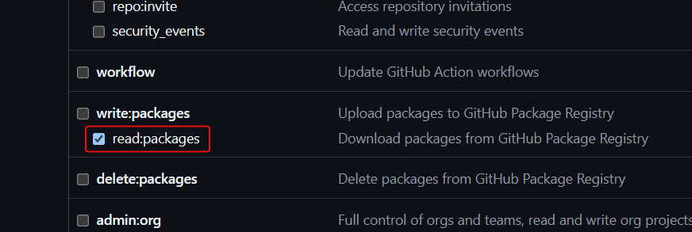

# GitHub Copilot presentation for `Getting Started` and `Deep Dive` sessions

This project contains presentations for the **GitHub Copilot Getting Started** and **GitHub Copilot Deep Dive** sessions that uses the [Slidev](https://sli.dev/) framework with a custom [theme from Xebia](https://github.com/xebia/presentation-templates). The presentations are designed to introduce and explain GitHub Copilot, an AI coding assistant.

## Presentation

A static version of the presentation is available at the [GitHub Pages](https://potential-adventure-or9mm99.pages.github.io/). Note, that this static version does not include the interactive elements and animations available in the live presentation as well as the really cool presenter mode. For this you can run the presentation [locally](#usage).

## Usage

To install the dependencies, you need to configure a Personal Access Token (PAT) for accessing the `@xebia` npm package. Follow these steps:

1. Generate a PAT from your GitHub account with the `read:packages` scope.
   
2. Create or update your `.npmrc` file in your home directory (e.g., `~/.npmrc`, or `C:\Users\<windows-user>\.npmrc` for windows) with the following content:
   ```
   //npm.pkg.github.com/:_authToken=YOUR_PERSONAL_ACCESS_TOKEN
   ```
   Replace `YOUR_PERSONAL_ACCESS_TOKEN` with your actual token.
3. Run `npm install` to install the dependencies.

This configuration ensures that the `@xebia` scoped packages can be downloaded from the GitHub registry.

- **Development**: Run `npm start` to start the presentation in development mode.
- **Build**: Run `npm run build` to build the presentation for production.
- **Export**: Run `npm run export` to export the presentation to PDF or PNG format.

> [!NOTE]
> **Select presentation:**
>
> By default the project includes both **Getting Started** and **Deep Dive** presentations. To render only one of the presentations please comment in/out the respective `src` lines in the `slides.md` file.

## Create custom speaker slide

You can create a custom speaker slide for the presentation:

- Add your profile picture, eg. `public/speaker/johndoe.jpg`
- Add a new folder with your handle, eg. `speaker/johndoe/`
- Copy the `speaker/%SLIDEV_SPEAKER%/speaker.md` file to your folder and adjust the profile image and the content
- Copy the `.env.template` file and rename it to `.env`
- Adjust the speaker handle in the `.env` file, eg. `SLIDEV_SPEAKER=johndoe`

> [!WARNING]
> Please don't rename the folder `speaker/%SLIDEV_SPEAKER%/`. The folder name `%SLIDEV_SPEAKER%` is required for the **Slidev** VS Code extension to work properly.

## Create custom speaker note

You can create custom speaker note to override the default note:

- If the slides frontmatter
  - don't contain a `_note` variable, add a new `_note: speaker/%SLIDEV_SPEAKER%/notes/note.md` variable with a descriptive filename of the note
  - contain a `_note` variable, add a new file with the filename in the variable to the notes folder in your speaker folder
- Edit the content of your custom speaker note

**Example:**

```yaml
---
title: Agenda
_note: speaker/%SLIDEV_SPEAKER%/notes/agenda.md
---
```

> [!IMPORTANT]
> If the slides frontmatter contains a `_note` variable, but the file don't exists in the speaker notes folder, the default slide note will be displayed.

> [!NOTE]
> The logic for the replacement of the speaker notes can be found in the `setup\preparser.ts` file in the `transformNote()` method.

## Server-Mode with CloudFlare tunnel
You can also run the presentation in server mode inclusding a CloudFlare tunnel. This allows you to share the presentation with others.
You simply need to have a CloudFlare account and need to be logged in in your browser.

Then you can run
```sh
slidev -- --remote=yourPassword --tunnel
```
This will start the presentation and create a tunnel to the CloudFlare network. You can then share the link with others.
The password is needed to prevent others from taking over your presentation and from exporting your slides as PDF.

## Using variables

To define custom variables you can set them in the `.env` file or as environment variables.

- `SLIDEV_PREFIX`: The Slidev variables prefix, optional, default: `SLIDEV_`
- `SLIDEV_SPEAKER`: The the speaker handle, required

Use the variable in markdown as `%SLIDEV_SPEAKER%`. At compile time the `setup\preparser.ts` replaces the variables in markdown with the values. You can also add custom variables and use them in markdown as described.

## Project Structure

- **Presentation Content**:
  - `slides.md` contains some kind of index for all slide decks. This index must be maintained manually when adding new slide decks
  - all other `slides_*.md` files in the root folder contain the actual slide decks
  - `slides/` folder contains the content of the slide decks, such as chapter and common slides
- **Public Assets**:
  - Images used in the presentation (`public`)

- **GH-Pages**:
  - `build.sh` script to build each slide deck into a subfolder, these must be manually linked in the `slides.md` file
- **Components**:
  - `components/DefinitionList.vue`, `components/ImageText.vue`, `components/ImageTitle.vue`
  
- **Styles**:
  - Custom CSS (`styles/index.ts`, `styles/code.css`)
- **Configuration Files**:
  - `.editorconfig`, `.gitignore`, `.npmrc`, `.prettierrc`
- **VS Code Settings**:
  - `.vscode/extensions.json`, `.vscode/tasks.json`
- **Package Configuration**:
  - `package.json` defines the dependencies and scripts for the project.

