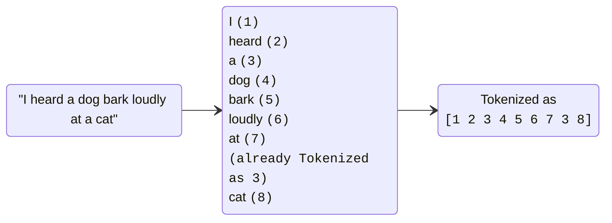
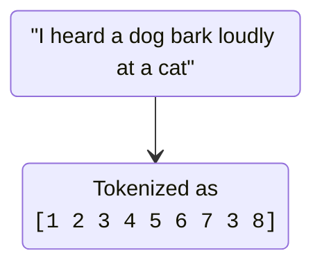
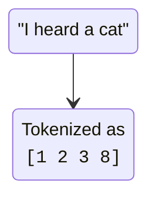
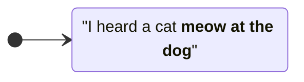

# GitHub Copilot Completions

---
level: 2
---

# GitHub Copilot Completions

Copilot automatically offers suggestions to complete your code, comments, tests, and more

 

<v-click>

## Code completions

While typing Copilot provides code suggestions that match your coding style and take your existing code into account

</v-click>

 

<v-click>

## Next Edit Suggestions

Predict your next code edit with **Copilot Next Edit Suggestions**

 

Settings in `settings.json`

`"github.copilot.nextEditSuggestions.enabled": true`

</v-click>

<!--
Copilot provides two kinds of suggestions

[click]
Code completions

[click]
Next Edit Suggestions

💡 Paste links in chat:

- [Code completions with GitHub Copilot in VS Code](https://code.visualstudio.com/docs/copilot/ai-powered-suggestions)

ℹ️ _NES_ are kind of refactoring feature based on LLM  
⚠️ _NES_ may interfere with the completions
-->

---
layout: image-right
background: /code-right.png
backgroundPosition: right
title: GitHub Copilot Completions Demo
level: 2
---

  <h1>GitHub Copilot Completions Demo</h1>

<!-- The empty clicks are only for the presenter mode to switch between the demos -->
<v-click>
  
</v-click>

<v-click>
  
</v-click>

<v-click>
  
</v-click>

<v-click>
  
</v-click>

<v-click>
  
</v-click>

<v-click>
  
</v-click>

<v-click>
  
</v-click>

<v-click>
  
</v-click>

<!--
Use the [Copilot bootcamp repo ](https://github.com/xebia/Copilot-Bootcamp-ForEndUsers) for these demos

⚠️ Disable **Next Edit Suggestions** as they may interfere with the completions

💡 Use the `PlanesController.cs` class for the demo

[click]
**Context suggestions**

- Place the cursor at the bottom after the `SetupPlanesData()` function, press `Enter`
- GitHub Copilot will automatically suggest the `[HttpPut(“{id}")]` method
- Accept the suggestion by pressing `Tab` to accept this attribute
- Press `Enter`, Copilot will now automically suggest the code for this method, press `Tab` to accept

[click]
**Inline suggestions**

- Start typing _private void CreateOr_  
- The method signature should be suggested

[click]
**Generate suggestions from code comments**

- Use the comment  
  _// create a private function to create or update a plane_
- Press `Enter`  
- ⚠️ Wait for the response

💡Show the differences using the following comment

- Use the comment  
  _// create a private function to create or update a plane by using all properties_
- Press `Enter`  
- ⚠️ Wait for the response

ℹ️ Sometimes the prompt must be adjusted to get the expected result

[click]
**Suggestions**

- Go to the `Planes` list definition  
- After the last item add `,` and press `Enter`  
- ⚠️ Wait for the response

[click]
**Suggestions Tab**  
⚠️ **IMPORTANT:**  
Check if the key binding (`github.copilot.generate`) for the `Ctrl + Enter` shortcut is set.

- Go to the `Planes` list definition  
- After the last item add `,` and press `Ctrl + Enter`

[click]
**Inline Chat**

- Go to the `Planes` list definition  
- After the last item add `,` and press `Ctrl + I`  
- Add comment into the Inline Chat  
  _add additional planes using historical data of the wright brothers_

[click]
**Chat Window**

- Go to the `Planes` list definition  
- After the last item add `,` and press `Ctrl + Alt + I`  
- Add comment into the Inline Chat  
  _add additional planes using historical data of the wright brothers_

[click]
**Next Edit Suggestions**

💡 Check if the setting is enabled

- Go to the `public class PlanesController` definition  
- Add `Abc` after the class name  
- ⚠️ Wait for the response

ℹ️ _NES_ for the constructor and the `_logger` should be provided
-->

---
layout: image-left
background: /pilot-1-left.png
level: 2
---

# Tip: Change Copilot Completions Model

 

 

<!--
Default model for Copilot Completions is **GPT-4o**. Nevertheless the model can be changed.
-->

---
layout: image-left
background: /pilot-1-left.png
level: 2
---

# Benefits Of GitHub Copilot

<v-clicks>

- Takes care of **mundane tasks**, leaves developers **more focused** on **business value**
- Developers stay **in the flow** thanks to accurate **code suggestions**
- Developers are **happier** because they can create more **"real" value**
- Direct access to the **knowledge of a million developers** thanks to the trained **LLMs**
- **Integrated** in the IDE

</v-clicks>

---
level: 2
---

# How Does It Work?

    
    
    
    
    

<!--
**SPEAKER NOTES**:

“What’s actually happening when Copilot fulfills a request?”

Copilot **assembles context** from **tabs open** in the code editor
Once context has been established in the code editor, the **prompt** passes via **HTTPS** to a **proxy** service.

[click]
On the **proxy**, we apply several pre-model **filters**

First, we test for **toxic language**. Things like hate speech, sexual content, violence, and evidence of self-harm.

💬 **CHAT ONLY**: Second, we **test** for **relevance**. An intent classifier ensures the service only responds to questions about code and software development.

💬 **CHAT ONLY**: Third, we **guard** against p**rompt hacking**. The service detects and blocks **attempts to trick the model** into returning service internals.

Assuming **all tests pass**, we pass the prompt to the **special language model**.

[click]
The model produces **N responses**, then **deletes the prompt**. Optional (For speaker knowledge): Your data will be shared if you are a copilot for individual user who has explicitly opted in to data sharing.

[click]
On the **proxy** again, we test for **code quality** and **matching public code**

**Code quality**:
Unique identifiers (eg.: emails, IPs, etc.)
Suggestions matching public code (optional based on enterprise policy)

[click]
In the **code editor**, developers choose which suggestions to **accept or reject**

**Note**: Administrators can enable a filter that blocks all suggestions over **150 characters that match public code** on GitHub.com (ignoring whitespace).
-->

---
level: 2
_note: speaker/%SLIDEV_SPEAKER%/notes/chapter/github_copilot_completions_what_is_an_llm_1.md
---

# What Is An LLM?

 

<!--
💡 Paste links in chat:

- [Open AI Tokenizer](https://platform.openai.com/tokenizer)
-->

---
layout: two-column
level: 2
_note: speaker/%SLIDEV_SPEAKER%/notes/chapter/github_copilot_completions_what_is_an_llm_2.md
---

# What Is An LLM?

::left::

::right::

Based on the **tokens** and **vectors**, **propose** the **next word** with **high probability**

 

