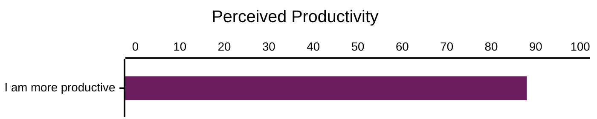
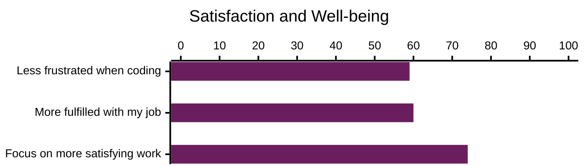
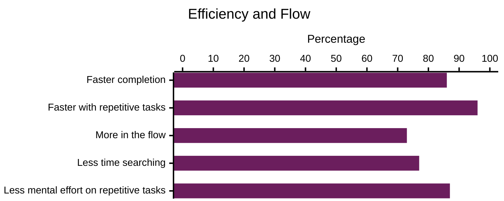

# Wrap-Up

---
layout: image-left
background: /plane-burning-left.jpg
level: 2
---

# Limitations And Pitfalls

<v-clicks>

* Dependence on training data
  * Security and vulnerability risks
  * Accuracy and reliability

* Prompt = context + question
  * Size limit for the prompt
  * Copilot does not understand the complete repository

* No computation
  * E.g. code coverage

* Slow responses

* Over-reliance by developers

* Learning curve

* Code quality

</v-clicks>

<!--
[click]
Dependence on training data

_Garbage in, garbage out_

[click]
Prompt = Context + Question

[click]
No Computation

No replacement for static analyzers

[click]
Slow responses

[click]
Over-reliance by developers

[click]
Learning curve

[click]
Code quality
-->

---
layout: image-left
background: /world-left.jpg
level: 2
---

# Dos And Don'ts

<v-click>

## Do

* Set clear goals
* Provide detailed instructions
* Refine through feedback
* Use for creativity and exploration
* Make **flight hours** by using Copilot

</v-click>

 

<v-click>

## Don't

* Rely blindly, always verify
* Disregard privacy
* Expect instant perfection
* Engage in unethical use

</v-click>

<!--
[click]
Do

[click]
Don't
-->

---
layout: image-left
background: /world-left.jpg
level: 2
---

# Quality Assurance

Copilot **predicts** code suggestions based on **data** it’s **trained** on

 

<v-click>

## Suboptimal Suggestions

* May be using outdated LLM version
* Struggles with niche or new technologies
* May oversimplify complex issues
* Risks including deprecated app

</v-click>

<!--
⚠️ **Emphasize:** Models are **NOT** deterministic!

[click]
Suboptimal Suggestions
-->

---
layout: image-left
background: /world-left.jpg
level: 2
---

# Quality Assurance

<v-click>

## Need for human judgement

- Copilot is not a replacement for developer insights

</v-click>

 

<v-click>

## Quality assurance pipelines

- Static code analysis
- Automated testing
- Pull requests and code reviews
- Monitoring and observability

</v-click>

 

<v-click>

## Remember ...

**You are the Pilot!**

</v-click>

<!--
[click]
Need for human judgement

[click]
Quality assurance pipelines
-->

---
layout: image-left
background: /plane-lock-left.jpg
---

<!-- issue in theme. See: https://github.com/xebia/presentation-templates/issues/12 -->
<h1 class="h-auto!">Privacy Concerns</h1>

<v-click>

## Code and customer data

Prompts and suggestions are not used for training AI models.

</v-click>

<v-click>

## Secure development

Prompts and suggestions are filtered for security issues and PII (Personally Identifiable Information) data.

</v-click>

<v-click>

## Personal data collection

- Prompts and suggestions are not retained  
  (through IDE for Chat and Code Completions)
- Prompts and suggestions are retained for 28 days  
  (other GitHub Copilot access and use)
- User engagement data retained for 24 months

</v-click>

<v-click>

## Intellectual property protection

Filter code suggestions snippets over 150 characters long

### GitHub Copilot Trust Centre

[https://copilot.github.trust.page](https://copilot.github.trust.page)

</v-click>

<!--
[click]
Code and customer data

[click]
Secure development

[click]
Personal data collection

[click]
Intellectual Property Protection

💡 Paste links in chat:

- [How long does GitHub retain Copilot data for Business and Enterprise customers?](https://copilot.github.trust.page/faq?s=b9buqrq7o9ssfk3ta50x6)
- [GitHub Copilot Trust Center](https://copilot.github.trust.page)
-->

---
layout: image-left
background: /evolution-left.jpg
level: 2
---

# Stay up to date

- Preview upcoming features for GitHub Copilot  
  [https://github.com/features/copilot/whats-new](https://github.com/features/copilot/whats-new)

- GitHub community - Copilot  
  [https://github.com/community/community/discussions/categories/copilot](https://github.com/community/community/discussions/categories/copilot)

- GitHub public roadmap  
  [https://github.com/github/roadmap](https://github.com/github/roadmap)

- **Xebia GitHub Copilot resources**
  [https://github-copilot.xebia.ms](https://github-copilot.xebia.ms)

<!--
💡 Paste links in chat:

- [Preview upcoming features for GitHub Copilot](https://github.com/features/copilot/whats-new)
- [GitHub community - Copilot](https://github.com/community/community/discussions/categories/copilot)
- [GitHub public roadmap](https://github.com/github/roadmap)
- [Xebia GitHub Copilot resources](https://github-copilot.xebia.ms)
-->

---
title: GitHub Copilot Impact
layout: image-left
background: /evolution-left.jpg
level: 2
---

<h1 class="h-auto!">GitHub Copilot Impact</h1>

([Survey from March 2024](https://github.blog/news-insights/research/research-quantifying-github-copilots-impact-on-developer-productivity-and-happiness/))
